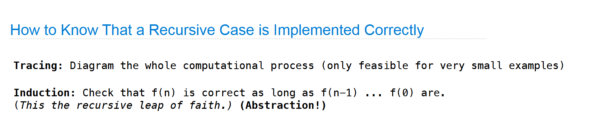
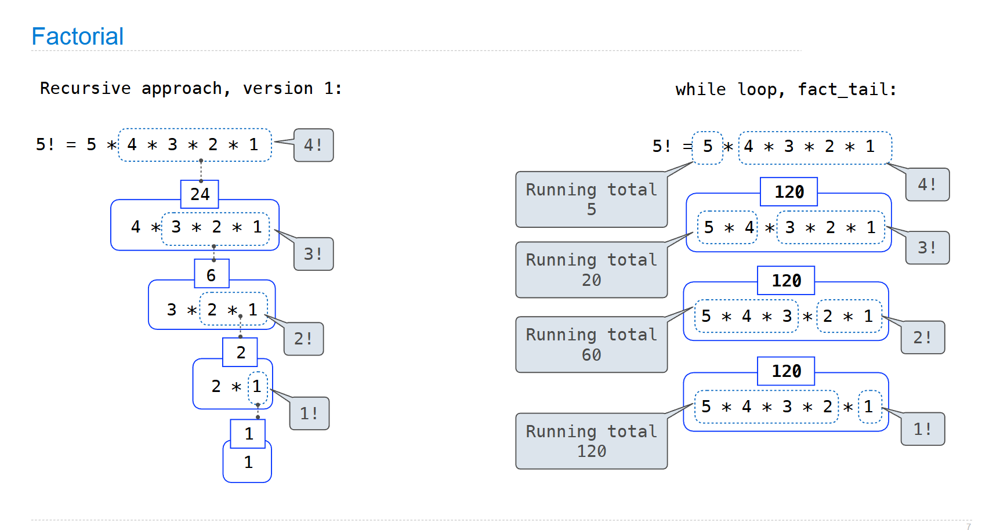

## 递归的信念飞跃



当你写一个 for 循环时，你告诉程序：“先做这一步，然后更新变量 $i$，然后检查条件，然后再做这一步……”你需要控制每一个细节。

当你写递归时，你是在声明定义。比如计算阶乘，你不是在想“我要怎么一步步乘起来”，而是在声明：“$n$ 的阶乘，其实就是 $n$ 乘以 $(n-1)$ 的阶乘。”你相信那个针对 $(n-1)$ 的调用会给你正确的结果。你不需要去管它内部是怎么跑的，你只需要利用它的结果来完成当前的任务。



同样的 对于汉诺塔问题，你不是在思考如何一步步移动盘子，而是在声明：“要把 $n$ 个盘子从 A 移到 C，首先把 $n-1$ 个盘子从 A 移到 B，然后把第 $n$ 个盘子从 A 移到 C，最后把 $n-1$ 个盘子从 B 移到 C。”你相信这个递归调用会正确地处理所有的细节。

这种信念飞跃是递归的核心。你不需要关心每一个细节，只需要相信递归调用会正确地处理它们。这种方式让你可以专注于问题的结构，而不是每一步的实现。

```cpp
// 递归函数：打印从 from 到 to 的移动步骤，借助 aux 作为辅助柱子
void hanoi(int n, char from, char aux, char to, unsigned long long& step_count) {
  if (n <= 0) return;  // 没有盘子，无动作
  if (n == 1) {
    // 直接将一个盘子从 from 移动到 to
    step_count++;
    cout << "Move disk 1 from " << from << " to " << to << '\n';
    return;
  }
  // 1) 把 n-1 个盘子从 from 移到 aux（把 to 当作辅助）
  hanoi(n - 1, from, to, aux, step_count);
  // 2) 把第 n 个盘子从 from 移到 to
  step_count++;
  cout << "Move disk " << n << " from " << from << " to " << to << '\n';
  // 3) 把 n-1 个盘子从 aux 移到 to（把 from 当作辅助）
  hanoi(n - 1, aux, from, to, step_count);
}
```

## 回溯

回溯是一种特殊的递归，它允许你在搜索空间中探索所有可能的解。它的核心思想是尝试一个解，如果不行就回退到上一步，尝试下一个可能的解。

```python
def backtrack(路径, 选择列表):
    if 满足结束条件:
        记录结果
        return

    for 选择 in 选择列表:
        # 1. 做选择 (尝试)
        做了一个决定 (比如把棋子放在这个位置)

        # 2. 递归 (信念)
        backtrack(路径, 新的选择列表)

        # 3. 撤销选择 (后悔)
        # 这一步至关重要！
        # 把棋子拿走，恢复成做决定之前的样子
        撤销刚才的决定
```
